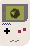
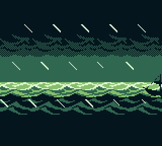

#  

CryBoy is a Gameboy emulator written in Crystal. The goal of this project is an efficient Gameboy emulator with highly readable code.

This would not be possible without the [Pan Docs](https://gbdev.io/pandocs), [izik's opcode table](https://izik1.github.io/gbops), or the [gzb80 opcode reference](https://rednex.github.io/rgbds/gbz80.7.html). A thanks also goes out to [PyBoy](https://github.com/Baekalfen/PyBoy), which was a useful reference when I first started this project.

## Installation

[SDL2](https://www.libsdl.org/) is a requirement for this project. Install that in whichever way you see fit.

After cloning the respository, you can install the required shards with `shards install`. If you don't do this directly, they'll be installed when you build the project.

## Usage

After installing the dependencies, the project can be built with `shards build --release`. At this point, the binary lives in `bin/cryboy`. The binary takes a an optional boot rom path and a rom path as its arguments: `bin/cryboy /path/to/rom` or `bin/cryboy /path/to/bootrom /path/to/rom`.

## Features and Remaining Work

CryBoy is still a work in progress. As of right now, all of the following features are supported

- CPU passes all of [blargg's cpu tests](https://github.com/retrio/gb-test-roms/tree/master/cpu_instrs).
- PPU renders on a scanline basis.
- PPU draws background, window, and sprites.
- Tetris seems to work without any issues (other than missing sound).
- MBC1 cartridges are supported.

There is still a lot missing from CryBoy. Some of these missing pieces include

- Audio processing
  - I've attempted audio processing and have implemented a mostly functional audio Channel 1. This resides [here](src/cryboy/apu.cr) in the repo. However, the Crystal garbage collector seems to have some issues when passing values to C libraries that manage their own threads. This has lead to occasional random background noise playing that SDL doesn't seem to be aware of, and has prevented me fro adding more channels of audio. The APU is on hold until this is fixed in the Crystal language, or at least until I've cleaned up more important pieces of the emulator.
- Picture processing
  - Rendering with SDL Textures
    - The [SDL2 bindings](https://github.com/ysbaddaden/sdl.cr) that I'm using don't support many of the bindings needed to render using SDL's texture maps, which would likely improve rendering efficiency dramatically. Textures would also make it easier to apply colors down the road.
  - Pixel FIFO
    - [Pixel FIFO](https://github.com/corybsa/pandocs/blob/develop/content/pixel_fifo.md) will likely only be relevant in 0.01% of games, so it's not a priority. It's a nice-to-have at some point down the road.

## Contributing

1. Fork it (<https://github.com/mattrberry/CryBoy/fork>)
2. Create your feature branch (`git checkout -b my-new-feature`)
3. Commit your changes (`git commit -am 'Add some feature'`)
4. Push to the branch (`git push origin my-new-feature`)
5. Create a new Pull Request

## Contributors

- [Matthew Berry](https://github.com/mattrberry) - creator and maintainer
