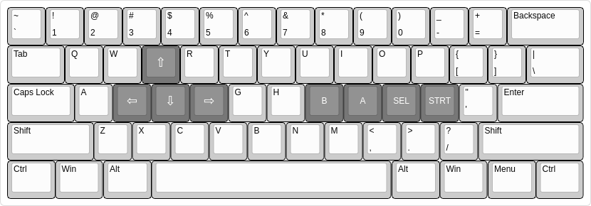

#  

CryBoy is a Game Boy (Color) emulator written in Crystal. The goal of this project is to create an efficient Game Boy emulator with highly readable code.

This would not be possible without the [Pan Docs](https://gbdev.io/pandocs), [izik's opcode table](https://izik1.github.io/gbops), or the [gzb80 opcode reference](https://rednex.github.io/rgbds/gbz80.7.html). A thanks also goes out to [PyBoy](https://github.com/Baekalfen/PyBoy), which was a useful reference when I first started this project.

## Installation

[SDL2](https://www.libsdl.org/) is a requirement for this project. Install that in whichever way you see fit.

After cloning the respository, you can install the required shards with `shards install`. If you don't do this directly, they'll be installed when you build the project.

## Usage

After installing the dependencies, the project can be built with `shards build --release`. At this point, the binary lives in `bin/cryboy`. The binary takes a an optional CGB bios path and a rom path as its arguments: `bin/cryboy /path/to/rom` or `bin/cryboy /path/to/bios /path/to/rom`.

Note: The Game Boy Color bios initializes the color palettes in some old Game Boy games to give them an updated look. This is why Pokemon Blue (which was developed for the original Game Boy and only had 4 colors) has a handful more colors, including a blue primary color and a red color for the character sprites. If you choose to launch a game for the original Game Boy without the Game Boy Color bios, you'll only see the games in 4 colors as you would on an original Game Boy. Games with native support for the Game Boy Color, like Pokemon Silver, _should_ behave the same with or without the bios.

### Compile-Time Flags

There are a couple of compile-time flags that you can take advantage of.

#### FIFO Rendering

To enable the experimental FIFO renderer (as opposed to the scanline renderer), you can build the project with the `-Dfifo` flag. The current FIFO implementation should work identically to the scanline renderer with the exception that it does not render sprites on column 0 of the LCD. However, it will play games like Prehistorik Man more accurately than the scanline renderer would, since that games relies on a cycle-accurate PPU implementation.

#### Pink Color Scheme

If you want to switch things up from the default green color scheme, there's a pretty, pink color scheme hiding behind the `-Dpink` flag.

### Keybindings

The current keybindings are very tuned to my own personal preferences. If the following layout diagram doesn't work for you, the "a" and "b" keys are also bound to their appropriate keys, as are the arrow keys.

## Features and Remaining Work

CryBoy is still a work in progress. As of right now, all of the following features are supported

- Passing all of [blargg's cpu tests](https://github.com/retrio/gb-test-roms/tree/master/cpu_instrs).
- Passing all of [blargg's instruction timing tests](https://github.com/retrio/gb-test-roms/tree/master/instr_timing).
- Passing all of [blargg's memory timing tests](https://github.com/retrio/gb-test-roms/tree/master/mem_timing).
- Passing all of [blargg's Game Boy Color sound tests](https://github.com/retrio/gb-test-roms/tree/master/cgb_sound)
- Passing all but one of the [mooneye-gb timer tests](https://github.com/Gekkio/mooneye-gb/tree/master/tests/acceptance/timer).
- PPU draws background, window, and sprites.
- PPU offers both scanline and FIFO rendering modes (behind a compile-time flag).
- Save files work as intended, and are compatible with other emulators like BGB.
- MBC1 cartridges are supported (except for multicarts).
- MBC3 cartridges are supported (except timers).
- MBC5 cartridges are supported.
- Controller support.
- Game Boy Color support, including HDMA, double-speed mode, and palettes.

There is still a lot missing from CryBoy. Some of these missing pieces include

- Picture processing
  - Pixel FIFO
    - I've made lots of progress into the FIFO renderer. There are still a couple issues that I have yet to resolve, though. The main one that seems to be specific to the pixel FIFO renderer is that I don't render sprites on column 0 of the LCD, although I still do render the rest of the sprite in its correct position even if the sprite's x position is less than 8.
- Misc
  - MBCs
    - MBC 2.
    - MBC 5 rumble.
    - Fixing an issue when roms misreport their size.
  - Failing the mooneye-gb rapid_toggle timer test by 4 T-cycles. Needs to be debugged.
  - Slight graphical glitch in Pokemon Crystal when opening menus, but entirely playable in both the scanline renderer and the FIFO renderer.
  - Major graphical glitches in Tomb Raider sprites in both the scanline renderer and the FIFO renderer.

## Contributing

1. Fork it (<https://github.com/mattrberry/CryBoy/fork>)
2. Create your feature branch (`git checkout -b my-new-feature`)
3. Commit your changes (`git commit -am 'Add some feature'`)
4. Push to the branch (`git push origin my-new-feature`)
5. Create a new Pull Request

## Contributors

- [Matthew Berry](https://github.com/mattrberry) - creator and maintainer
